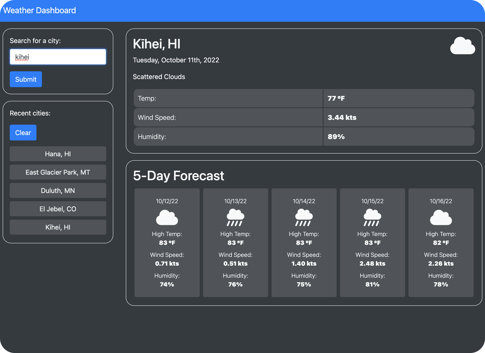

# Weather Dashboard

## Description

A web app that utilizes the server-side APIs offered by [OpenWeather](https://openweathermap.org/) to provide weather data based on user search criteria. The following features are implemented in accordance with the challenge criteria:
- Use of the **Fetch** API to retrieve data from server-side API endpoints.
- Use of various API endpoints offered by **OpenWeather**, including the **Geocoding**, **Weather**, and **Forecast** APIs, to obtain location and weather data.
- Thorough parsing and formatting of API response data to yield a clean and informative weather dashboard, including a summary of **current conditions** as well as a **5-day weather forecast**.

Extra features included for completeness and UX considerations include:
- A responsive, mobile-friendly UI built using **Bootstrap**.
- Use of scalable **FontAwesome** icons to represent weather conditions.

&nbsp;

## Usage

The page can be viewed [here](https://binderb.github.io/weather-dashboard/) on GitHub Pages. The page will display a search prompt, and when the user submits the name of a city, the page will display current weather conditions for that city (or a nearby city if the coordinates are a close match), as well as a 5-day forecast at that location. If no cities listed in the OpenWeather Geocoding API match the search criteria, an error prompt is displayed instead. Successful searches are logged in a "recent cities" panel and stored in the user's LocalStorage. The app will store the 5 most recent unique searches, and will delete older searches to keep the UI clean. Selecting a recent search from the panel will retrieved updated weather data from that location. Stored search results can be cleared at any time by clicking the "Clear" button.

## Credits

Data displayed by this app is retrieved from various API endpoints provided by [OpenWeather](https://openweathermap.org/). All code was written by the developer.

## License

Please refer to the LICENSE in the repo.